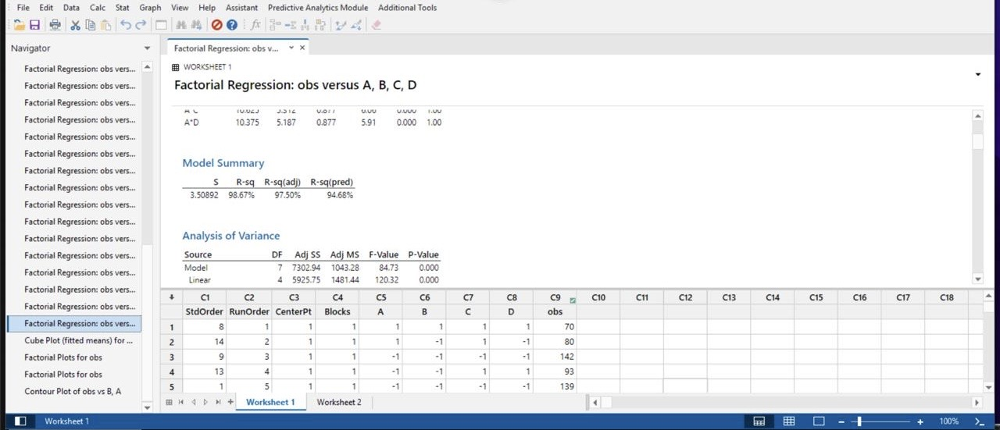
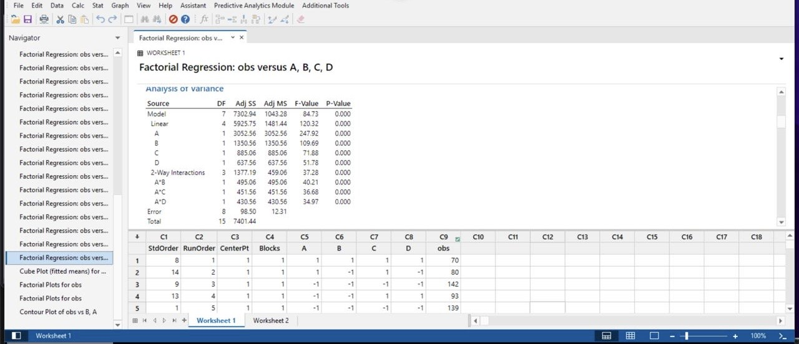
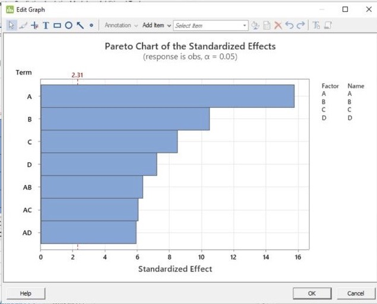
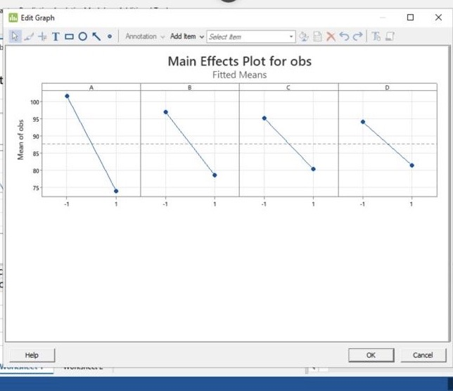
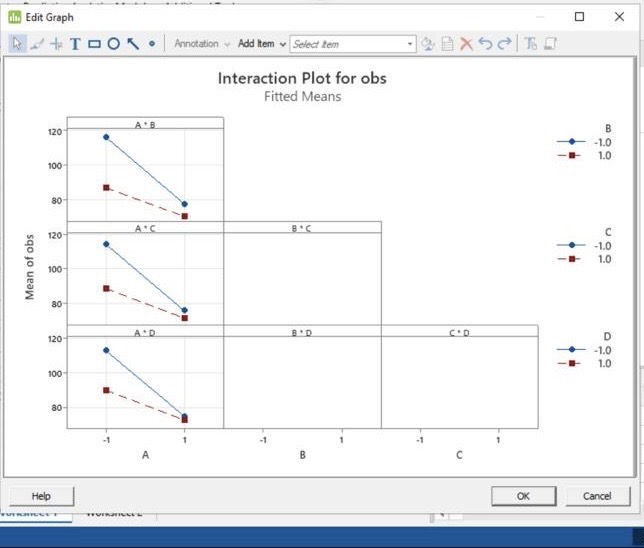
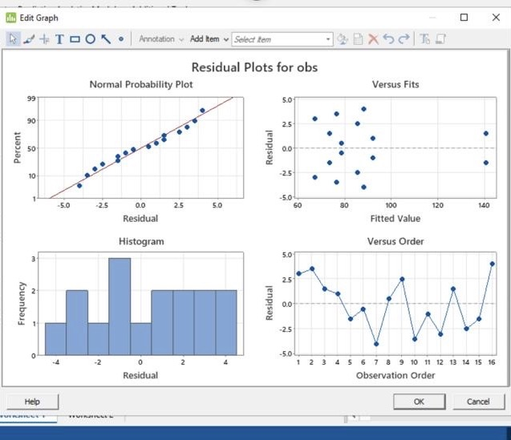
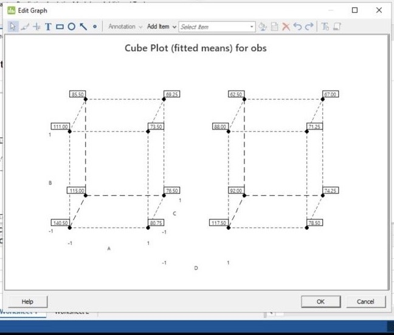

# LEGO Car Design Optimization (DOE / Minitab)

Used a 2-level factorial DOE and Minitab ANOVA to identify the most influential LEGO car design parameters affecting travel distance.

## Objective
Maximize distance traveled by optimizing wheel size, wheelbase length, car length, and number of wheels.

## Factor Level Coding (What -1 and +1 mean)
- **-1 = Low level**
- **+1 = High level**

| Factor | Description | -1 (Low) | +1 (High) |
|---|---|---|---|
| A | Wheel size | Small wheel | Large wheel |
| B | Wheelbase length | Short | Long |
| C | Car length | Small/Short | Large/Long |
| D | Number of wheels | 4 wheels | 6 wheels |

## Results (High level)
- Wheel size (A) was the dominant factor; small wheels improved distance.
- Significant interactions observed (A×B, A×C, A×D).
- Best setting: **A=-1, B=-1, C=-1, D=-1** (small wheels, short wheelbase, short car, 4 wheels).
- 
## Files
- Slide deck (PDF): [lego_doe_deck.pdf](docs/lego_doe_deck.pdf)

## Key Visuals

## Tools
Minitab, DOE, ANOVA, regression diagnostics
